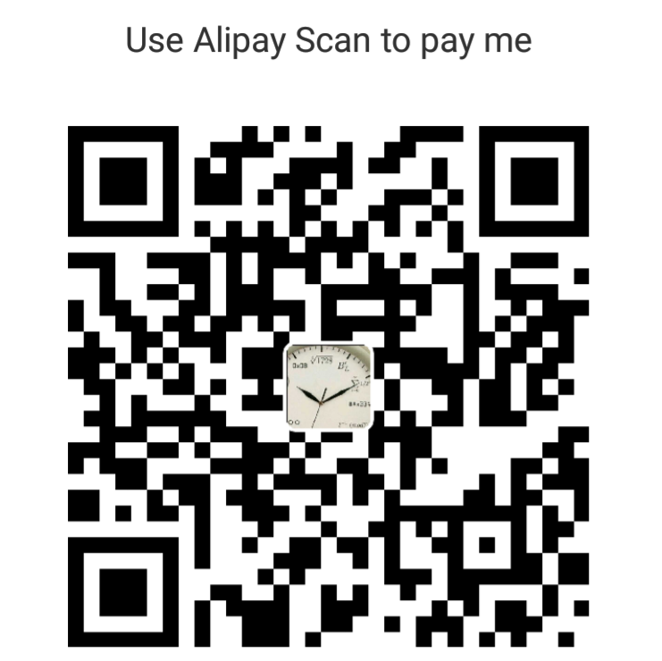

# ros-docker-images

[](https://microbadger.com/images/lmaths/ros "lmaths/ros docker images")


ROS desktop-full docker images with Qt C++ debug tool-chain for Fedora and other Linux users who do not use Ubuntu.

This project aims to build an All-in-One development environment for robot learning including robotics and deep reinforcement learning and a portable platform for intelligent robot applications.


# Features
- integrated with open source AMD and Intel GPU driver
- support gazebo simulation
- including QtCreator as ROS IDE which supports build and **debug** your ROS packages
- including [terminator](http://gnometerminator.blogspot.com/p/introduction.html), a multi-windows supported free terminal emulator
- including [ros desktop-full](http://wiki.ros.org/kinetic/Installation/Ubuntu) packages


# Usage
```shell
docker run --device /dev/dri  \
 --security-opt="label:disable"  \
 --security-opt seccomp:unconfined  \
 --env="DISPLAY" --env QT_X11_NO_MITSHM=1  \
 --volume="/tmp/.X11-unix:/tmp/.X11-unix:rw"  \
 --volume="/home/<your_user_name>/Workspace:/data:rw"  \
 --volume="/path/to/gazebo_models:/home/ros/.gazebo/models:rw"  \
 --name="ros_kinetic_devel"  \
 lmaths/ros:kinetic-ide terminator
```


# TODO List
- [ ] add NVIDIA driver Installation instruction
- [ ] add RoboWare IDE
- [ ] add reinforcement learning libraries, including rllab.
- [ ] add machine learning libraries.
- [ ] add deep learning, including tensorflow.


# Known Issues and Limitations
- It will be a large image.
- common issue about NVIDIA GPU driver  

# Reference


# LICENSE
This project is distributed under [MIT License](https://en.wikipedia.org/wiki/MIT_License).


# Pay What You Want
If this project really help you, you can pay for it.

Just scan the following QR code using [Alipay](https://play.google.com/store/apps/details?id=com.eg.android.AlipayGphone&hl=en) mobile application, and **any amount will be OK**.




***enjoy it!***
